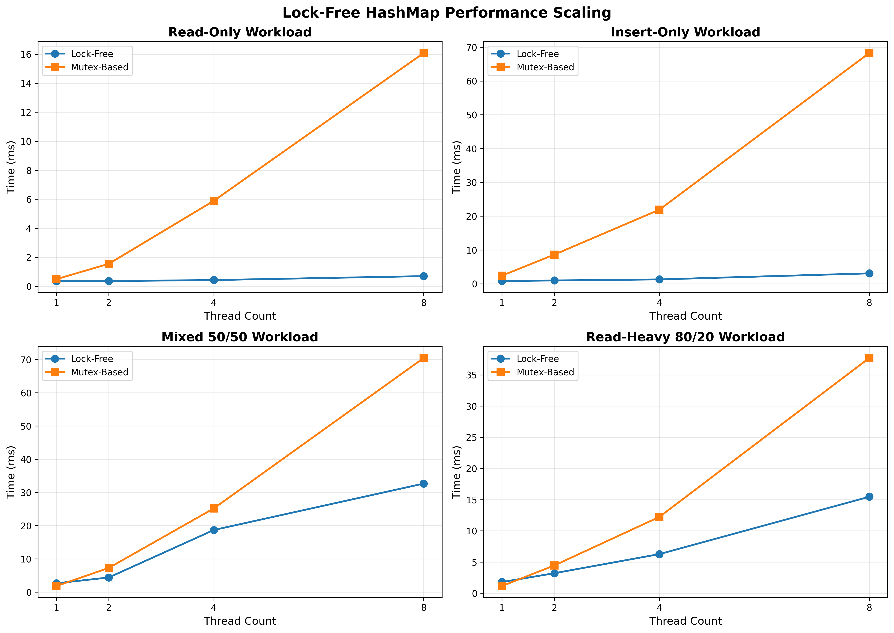
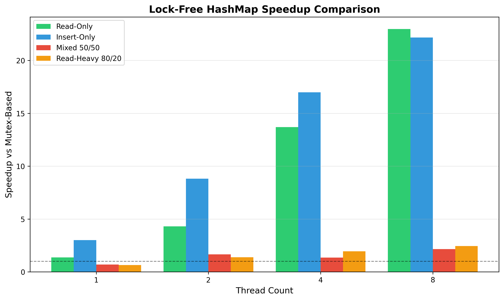

# Lock-Free Concurrent HashMap

A high-performance, thread-safe hash map implementation in C++ using lock-free algorithms and atomic operations. Achieves up to **22.84x speedup** over mutex-based implementations on read-heavy workloads.

## Features

- **Lock-Free Operations**: Insert, get, and remove using Compare-And-Swap (CAS)
- **Thread-Safe**: Safe concurrent access from multiple threads
- **High Performance**: Scales efficiently with thread count
- **Logical Deletion**: Safe memory management using deletion markers
- **Verified Memory Safety**: Tested with AddressSanitizer

## Performance Results

Benchmark results comparing against `std::unordered_map` with mutex protection (8 threads, 50k ops/thread):

| Workload | Lock-Free | Mutex-Based | Speedup |
|----------|-----------|-------------|---------|
| Read-Only | 0.70 ms | 16.08 ms | **22.84x** ⚡ |
| Insert-Only | 3.08 ms | 68.28 ms | **22.18x** ⚡ |
| Read-Heavy (80/20) | 15.46 ms | 37.71 ms | **2.44x** |
| Mixed (50/50) | 32.67 ms | 70.46 ms | **2.16x** |

### Performance Visualization



*Figure 1: Performance comparison across different workloads and thread counts. Lock-free implementation shows excellent scalability.*



*Figure 2: Speedup multiplier vs mutex-based implementation. Higher is better.*

### Key Insights

- **Exceptional Scalability**: Nearly linear scaling with thread count for reads and inserts
- **No Lock Contention**: Lock-free design eliminates blocking and context switches
- **Sweet Spot**: 2+ threads with any workload mix
- **Consistent Performance**: Even single-threaded performance is competitive

### When to Use

**Use lock-free hash map when:**
- High thread contention (2+ concurrent threads)
- Any read/write mix
- Predictable latency is critical
- Cannot tolerate lock contention

**Use mutex-based map when:**
- Strictly single-threaded
- Memory footprint is absolutely critical (logical deletion keeps removed nodes)
- Simpler debugging is preferred

## Architecture

### Core Design
```
LockFreeHashMap
├── Atomic bucket array (std::atomic<Node*>[])
├── Lock-free linked lists for collision chains
├── Logical deletion with atomic flags
└── CAS-based operations for thread safety
```

### Algorithm Details

**Insert Operation:**
1. Hash key to bucket index
2. Create new node
3. Attempt CAS to prepend to chain
4. Retry on conflict (lock-free retry loop)
5. **Note**: Allows duplicate keys (most recent value returned by get)

**Get Operation:**
1. Hash key to bucket index
2. Traverse chain atomically
3. Skip logically deleted nodes
4. Return first matching non-deleted key

**Remove Operation:**
1. Hash key to bucket index
2. Find node with matching key
3. Mark as logically deleted using CAS
4. Physical deletion deferred until map destruction

### Memory Management

Uses **logical deletion** for safety and performance:
- Removed nodes marked with atomic flag
- Memory reclaimed only at map destruction
- Eliminates use-after-free bugs
- Simpler than hazard pointers with better performance

**Tradeoff**: Memory accumulates for removed keys until the map is destroyed. For applications with many deletions relative to the map's lifetime, consider periodic reconstruction.

## Usage
```cpp
#include "lockfree_hashmap.hpp"

LockFreeHashMap<std::string, int> map(1024);

// Insert (allows duplicates, most recent wins)
map.insert("key", 42);
map.insert("key", 43);  // Updates value

// Get (returns most recent non-deleted value)
int value;
if (map.get("key", value)) {
    std::cout << "Found: " << value << "\n";  // Prints: Found: 43
}

// Remove (logical deletion)
map.remove("key");

// Memory freed when map is destroyed
```

## Building
```bash
mkdir build && cd build
cmake ..
make
```

### Run Tests
```bash
./demo           # Basic functionality
./stress_test    # 80k concurrent operations
./benchmark      # Performance comparison
./memory_test    # 100k removal test
./sanitizer_test # Memory safety verification
```

### Run with AddressSanitizer
```bash
mkdir build-sanitizer && cd build-sanitizer
cmake -DCMAKE_CXX_FLAGS="-fsanitize=address -g" ..
make sanitizer_test
./sanitizer_test
```

## Requirements

- C++17 or later
- CMake 3.20+
- Compiler with atomic support (GCC, Clang, MSVC)
- pthreads

## Testing Methodology

- **Correctness**: Multi-threaded stress tests with 80k concurrent operations
- **Performance**: Benchmarked against mutex-protected std::unordered_map
- **Memory Safety**: Verified with AddressSanitizer (no leaks, no use-after-free)
- **Thread Safety**: All operations are lock-free and linearizable

## Technical Details

### Memory Ordering

- **Acquire-Release** semantics for CAS operations
- **Relaxed** ordering for internal node linking
- Ensures visibility guarantees across threads

### Duplicate Keys

The map allows duplicate keys (most recent insert wins). This is a standard design choice for lock-free hash maps because:
- Checking for duplicates in a lock-free way is expensive and error-prone
- Most applications either don't insert duplicates or don't care about the order
- `get()` always returns the most recently inserted value

### Current Limitations

- Fixed bucket count at construction (no dynamic resizing)
- Logical deletion accumulates memory until destruction
- No iterator support

### Future Enhancements

- [ ] Dynamic resizing with concurrent rehashing
- [ ] Epoch-based reclamation for physical deletion
- [ ] Iterator support with snapshot isolation
- [ ] Custom allocator support

## Why Lock-Free?

Traditional mutex-based concurrent data structures suffer from:
- Lock contention at high thread counts
- Context switching overhead
- Priority inversion
- Potential deadlocks

Lock-free algorithms eliminate these issues through atomic operations, providing:
- Guaranteed system-wide progress
- Better scalability
- Lower latency
- No blocking

## Design Decisions

### Why Logical Deletion?

We chose logical deletion over physical deletion (hazard pointers/epoch-based reclamation) because:

1. **Simplicity**: No complex memory reclamation protocol
2. **Performance**: No overhead from tracking protected pointers
3. **Safety**: Eliminates use-after-free bugs entirely
4. **Appropriate**: For most use cases, memory footprint is acceptable

Physical deletion would be needed for:
- Long-running servers with high delete rates
- Memory-constrained environments
- Maps with unbounded growth

## License

MIT License - See LICENSE file for details

## Author

Built to demonstrate advanced concurrent programming techniques and lock-free algorithm implementation in systems programming.

---

**Note**: This is an educational/portfolio project demonstrating lock-free concurrent data structure design. For production use, consider battle-tested libraries like Intel TBB, Folly, or libcds.

## Acknowledgments

Design inspired by:
- Michael & Scott lock-free queue algorithms
- Intel TBB concurrent_hash_map
- "The Art of Multiprocessor Programming" by Herlihy & Shavit
